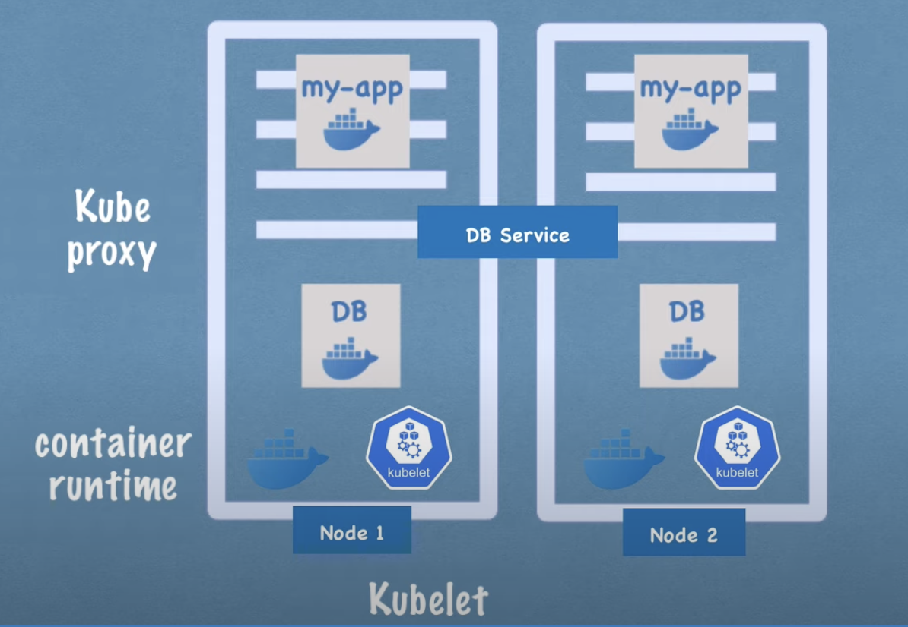
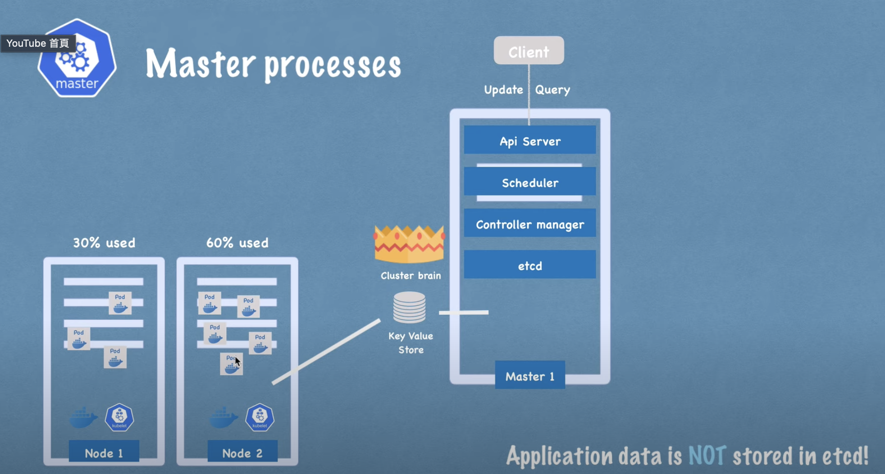

kubernetes server 架構分兩群

- master node
- worker node

## worker node

kubernetes 最小工作單位，會有多個 pod 運行在多個 worker node 上，有三種 processes 必定運行在每個 node 上面

- kubectl
- container runtime
- kube proxy
  

## master node

kubernetes 主要控制大腦，有四種 processes 運行在每一個 master node 上面

- Api Server: api request -> validate request -> forward to other processes.
- Scheduler: new pod -> api server -> schedule -> which node pod should be scheduled.
- Controller Manager: detects cluster state change, eg: 找出 resource 較充足的 node.
- etcd: the brain of cluster, store the status of cluster change.

