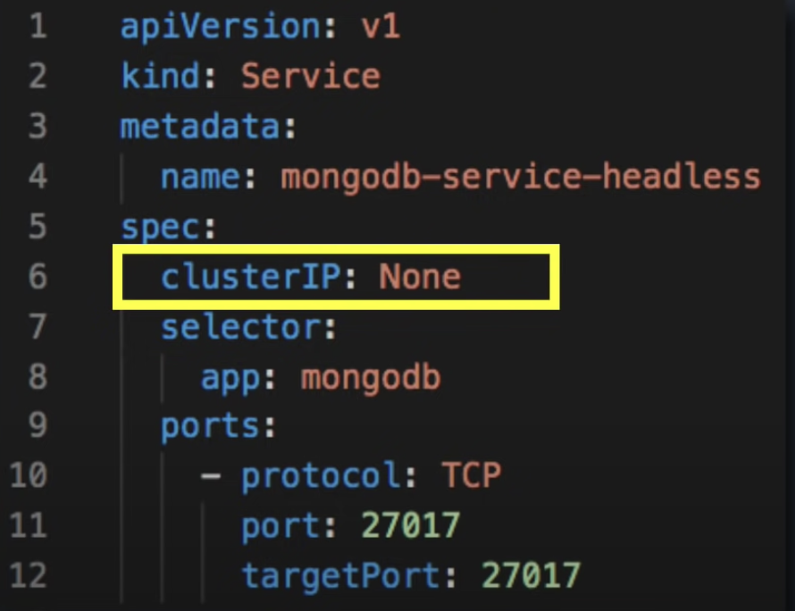
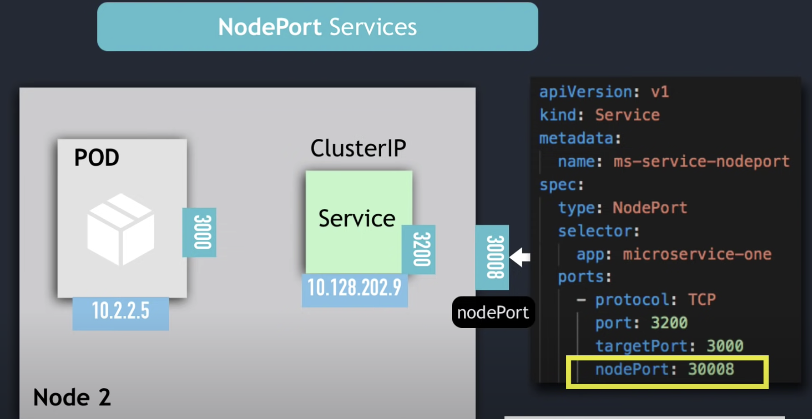
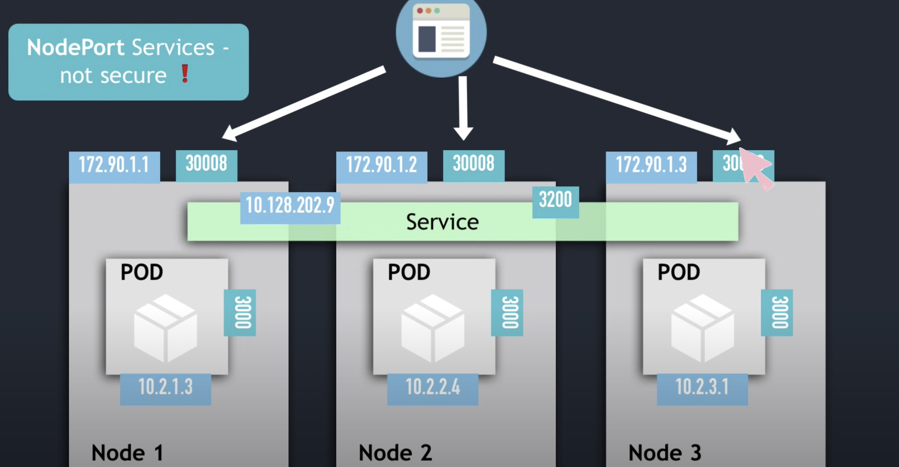
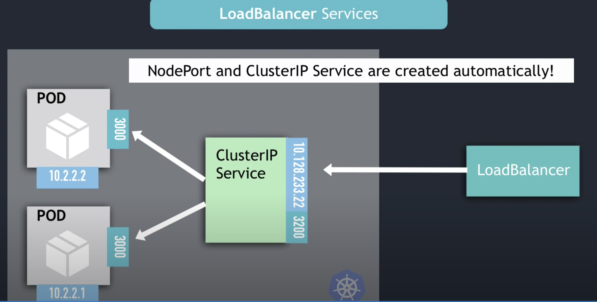
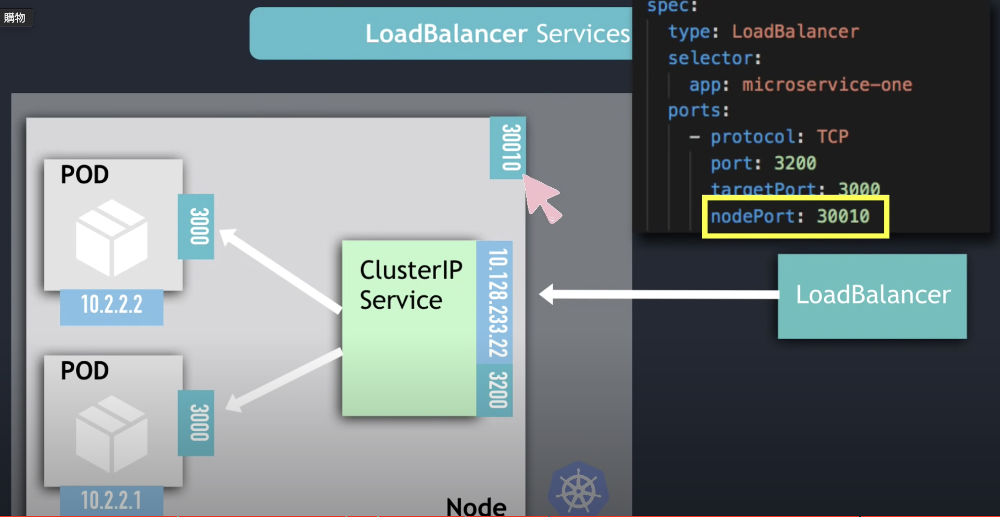

有 image.png 四種不同的 services

- ClusterIP Services
- Headless Services
- NodePort Services
- LoadBalancer Services

## ClusterIP Services

request 會傳到哪些 POD ?

- 符合 `selector` & label 條件

## Headless Services

使用於兩種狀況

1. client wants to communicate with 1 specific Pod
1. Pods want to talk with specific Pod
   

## NodePort Services

## LoadBalancer Services

---

## Reference

- [Kubernetes Services explained | ClusterIP vs NodePort vs LoadBalancer vs Headless Service](https://www.youtube.com/watch?v=T4Z7visMM4E)
